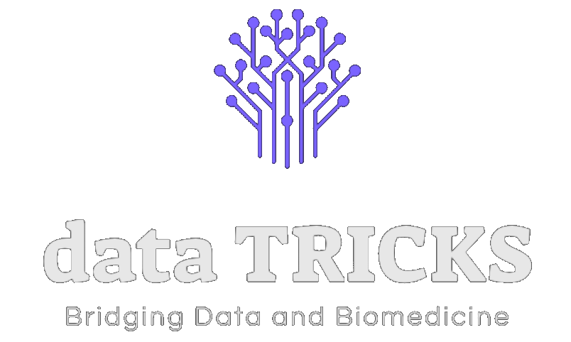

  
  
  
  
  

  
  

<!-- PROJECT LOGO -->
 

  

 <!--  <h3 align="center">dataTRICKS</h3>  -->

  

   <h3 align="center">Our Expertise, Your Solution 📈</h3> 
     
    

      <a href="https://github.com/Gpreciat/dataTRICKS/tree/main/projects"><strong>Explore our projects »</strong></a>
    

     
     
  

## About dataTRICKS

Welcome to the dataTRICKS GitHub Repository! We specialize in **Metabolic Engineering, Machine Learning, and Data Science**. Our primary focus is on processing and analyzing biological data, but we've also successfully applied our expertise to various domains, including banking and marketing.

At **dataTRICKS**, which stands for **Targeted solutions for Research, Innovation, and Consulting in Knowledge Science**, we are committed to delivering cutting-edge solutions and insights.

### Programming Languages
  - Python
  - MATLAB
  - Java
  - Git
  - LATEX

<!-- TABLE OF CONTENTS -->

  
Table of Contents

  <ol>
    <li>
      <a href="#about-datatricks">About dataTRICKS</a>
      <ul>
        <li><a href="#programming-languages">Programming Languages</a></li>
      </ul>
    </li>
    <li>
      <a href="#projects-repository-overview">Projects Repository Overview</a>
      <ul>
        <li><a href="#personalized-medicine">Personalized Medicine</a></li>
        <li><a href="#phenotype-characterization">Phenotype Characterization</a></li>
        <li><a href="#kmarxianus-phenotyping">K.marxianus Phenotyping</a></li>
        <li><a href="#omics-data-integration">Omics Data Integration</a></li>
        <li><a href="#dopaminergic-neuron-gem">Dopaminergic Neuron GEM</a></li>
        <li><a href="#chemoinformatics-integration">Chemoinformatics Integration</a></li>
        <li><a href="#sampling-solution-space">Sampling Solution Space</a></li>
      </ul>
    </li>
    <li><a href="#cv">CV</a></li>
    <li><a href="#license">License</a></li>
    <li><a href="#contact">Contact</a></li>
  </ol>

### Personalized Medicine
  Here, it is presentes machine learning projects, ranging from classic algorithms to deep learning models. These projects highlight the skills in developing predictive models and uncovering valuable patterns from complex datasets.

[Check it out!](https://github.com/Gpreciat/dataTRICKS/)

  ### Phenotype Characterization
  In the Phenotype Characterization directory, shows capabilities in data preprocessing, exploratory data analysis (EDA), and data visualization. These are the fundamental steps in gaining insights from data.

[Check it out!](https://github.com/Gpreciat/dataTRICKS/)

  ### K.marxianus Phenotyping
  In the K.marxianus Phenotyping section, shows metabolic engineering-focused data preprocessing. These tailored approaches are crucial for extracting valuable insights from K.marxianus Phenotyping data through metabolic engineering techniques.

[Check it out!](https://github.com/Gpreciat/dataTRICKS/)

  ### Omics Data Integration
  In this directory, you will find projects related to metabolic engineering and the optimization of biochemical processes. I demonstrate my expertise in modeling and manipulating metabolic pathways.

[Check it out!](https://github.com/Gpreciat/dataTRICKS/tree/main/projects/omicsDataIntegration)

  ### Dopaminergic Neuron GEM
  This directory contains projects related to software development, where I demonstrate my proficiency in building efficient and scalable applications tailored to specific business needs.

[Check it out!](https://github.com/Gpreciat/dataTRICKS/)

  ### Chemoinformatics Integration
  In this directory, you will find my research-oriented projects. Although an enthusiast, I take on research initiatives to contribute to cutting-edge knowledge and innovations.

[Check it out!](https://github.com/Gpreciat/dataTRICKS/)

  ### Sampling Solution Space
  This directory contains projects related to software development, where I demonstrate my proficiency in building efficient and scalable applications tailored to specific business needs.

[Check it out!](https://github.com/Gpreciat/dataTRICKS/)

## CV
  You can find my detailed CV [here](https://github.com/Gpreciat/dataTRICKS/blob/main/cv/gPreciatCv.pdf).

<!-- License -->
## License
  Distributed under the dataTRICKS License. See `LICENSE` for more information.

## Contribution and Contact

We are open to collaborations and welcome feedback on our projects. Feel free to reach out to us through the contact information available in our GitHub profile. 

German Preciat, PhD - [@gpreciat](https://www.linkedin.com/in/gpreciat/) - gapreciat@gmail.com

Project Link: [https://github.com/Gpreciat/dataTRICKS/](https://github.com/Gpreciat/dataTRICKS/)

Thank you for visiting dataTRICKS! Let's revolutionize knowledge science together! :rocket::microscope::gear: