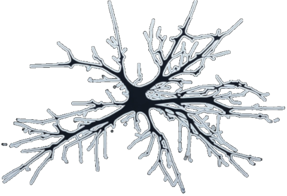

  
  
  
  

  

# Dopaminergic Neuron GEM (iDopaNeuro): Omics-Powered Repository

  

## Introduction

This repository contains the code and resources related to the research project aimed at gaining a deeper understanding of the metabolic mechanisms underlying Parkinson's Disease. 

## Project Overview

The objective is to design a Genome-Scale Metabolic Model (GEM) specific to dopaminergic neurons. What sets our methodology apart is the integration of omics data, including transcriptomics, metabolomics, and bibliomics, into the GEM construction process. It was also developed a custom function called [XomicsToModel](https://github.com/Gpreciat/dataTRICKS/tree/main/projects/omicsDataIntegration) that plays a crucial role in generating omics-integrated GEMs.

## Methodology

The methodology involves the following key steps:

1. **In Vitro Differentiation**: Human neuroepithelial stem cells were differentiated into midbrain-specific dopaminergic neuronal cultures in vitro.

2. **Data Generation**: Transcriptomic and targeted exometabolomic data were generated from fresh and spent media samples.

3. **Literature Curation**: Cell-type-specific data were derived from manual curation of the literature on dopaminergic neuronal metabolism.

4. **Model Integration**: Omics data were integrated with a generic metabolic model derived via [XomicsToModel](https://github.com/Gpreciat/dataTRICKS/tree/main/projects/omicsDataIntegration), from a comprehensive reconstruction of human metabolism.

5. **Model Generation**: An ensemble of candidate dopaminergic neuronal metabolic models were generated, considering technical parameters and mathematical modeling approaches.

6. **Model Selection**: Models with the highest predictive fidelity were identified, giving preference to either in vitro experimental data (iDopaNeuro condition specific; iDopaNeuroC) or dopaminergic neuronal literature curation (iDopaNeuro cell-type specific; iDopaNeuroCT).

7. **Validation**: The predictive fidelity of the iDopaNeuro models was validated by comparison with independent exometabolomic data generated on perturbations to normal dopaminergic neuronal metabolism in vitro.

8. **Prospective Experiments**: Finally, the iDopaNeuro models were used prospectively to design exometabolomic experiments to generate new constraints on the variables currently most uncertain via [Sampling analysis](https://github.com/Gpreciat/dataTRICKS/tree/main/projects/samplingSolutionSpace) in the model.

## Conclusion

This multidisciplinary project aims to shed light on the metabolic mechanisms of Parkinson's Disease using cutting-edge computational modelling and data integration techniques. This work is a testament to the power of combining diverse sources of data to gain insights into complex biological systems.

## Publication (Manuscript Under Review)

For a comprehensive understanding of the complete procedure, please refer to the publication (manuscript under review). We are currently in the review process, and the manuscript will be updated to the corresponding journal once it is accepted.

[Link to Manuscript (Under Review)](https://www.biorxiv.org/content/10.1101/2021.06.30.450562v2)

Please explore the code and resources in this repository to learn more about the research.

## License

This project is dual-licensed under two licenses: [dataTRICKS](https://github.com/Gpreciat/dataTRICKS/blob/main/LICENSE.txt) (since I authored the code) and the [COBRA Toolbox](https://github.com/opencobra/cobratoolbox/tree/master/) license (as the project was further developed there). Users are encouraged to review and comply with the terms of both licenses.

For details on the licenses, please refer to the respective repositories.

## Contribution and Contact

We welcome contributions and feedback from the research community. If you have any questions, suggestions, or would like to collaborate, please feel free to contact us through the information provided below:

**German Preciat, PhD**
- LinkedIn: [@gpreciat](https://www.linkedin.com/in/gpreciat/)
- Email: gapreciat@gmail.com

Join me in unraveling the mysteries of dopaminergic neurons and their role in Parkinson's Disease! 🧠🔬📈
